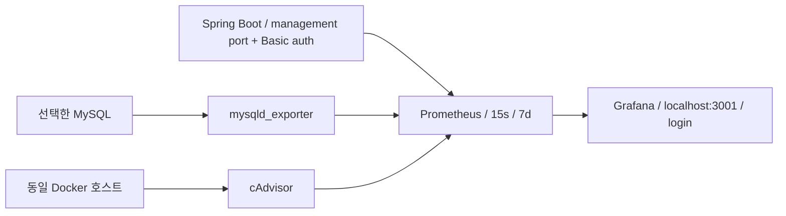

# 선잘알 로컬 성능 모니터링

## 구성과 적용 범위

Spring Boot 4.1.1 / Java 25 / Micrometer 1.17.1 / HikariCP 7.0.2 / Hibernate 7.4.5.Final.
Actuator는 기존 의존성을 재사용하고 `micrometer-registry-prometheus`만 추가했다. 버전은 Boot BOM에 맡긴다.
기존 Sentry 8.56.0, 로깅, 비즈니스 로직, Dockerfile 및 CI 설정은 유지한다.
현재 저장소에는 운영 Compose/배포 실행 설정이 없어 운영 DB 버전·네트워크·제한값은 확인되지 않았다.



Compose는 모니터링 도구 4개만 실행한다. 앱·DB는 현재 환경의 것을 연결한다.
Prometheus는 시계열 저장/조회, Grafana는 비교 화면, mysqld_exporter는 DB 전역 상태,
cAdvisor는 컨테이너 자원/제한 상태를 담당한다. node_exporter와 추가 tracing 도구는 도입하지 않았다.

## 실행: 연결 설정 → 앱 → 모니터링

1. 기존 `.env`에 `.env.example`의 Monitoring 항목을 채운다. 앱의 DB 설정과 exporter의 DB 설정은 독립적이다.
   `MONITORING_PASSWORD`는 `openssl rand -hex 32`로 생성하고 `GRAFANA_ADMIN_PASSWORD`,
   `MYSQL_EXPORTER_PASSWORD`도 별도 값으로 지정한다. 비밀번호를 소스/공유 명령/로그에 넣지 않는다.
2. 대상 MySQL에서 아래 전용 계정을 준비한다. 기존 관리자 클라이언트에서 비밀번호를 대체하여 실행한다.
3. 앱에 `monitoring` 프로필을 추가하고 관리 포트 접근 범위를 맞춘다.
4. 설정을 생성하고 Compose를 실행한다.
5. Grafana에 로그인하고 검증 스크립트를 실행한다.

```sql
-- '%' 대신 실행 환경의 exporter 출발지/내부 서브넷으로 좁힐 수 있으면 좁힌다.
CREATE USER 'monitoring'@'%' IDENTIFIED BY '<별도 exporter 비밀번호>' WITH MAX_USER_CONNECTIONS 3;
GRANT PROCESS ON *.* TO 'monitoring'@'%';
```

위 권한으로 검증용 MySQL 8.4의 모든 활성 collector 성공을 확인했다.
기본 global_status/global_variables 및 InnoDB 압축 정보 수집을 사용하며 replication collector는 끈다.
사업 테이블에 대한 SELECT·쓰기 권한과 REPLICATION CLIENT는 부여하지 않는다.
PROCESS는 전역 세션 관측 권한이므로 전용 계정과 네트워크 제한을 함께 적용한다.
Performance Schema 상세 분석은 별도 진단 계정에 필요한 테이블만 SELECT를 부여한다.

```bash
# .env는 기존 정책대로 셸 호환 형식을 사용한다. 값을 출력하지 않는다.
set -a
source .env
set +a

# 호스트 JVM: 기존 환경변수를 그대로 사용한다.
./gradlew bootRun --args='--spring.profiles.active=local,monitoring'
```

앱을 시작한 터미널과 별도 터미널에서 동일 `.env`를 내보낸 뒤:

```bash
PYTHONDONTWRITEBYTECODE=1 python3 monitoring/configure.py
docker compose -f compose.monitoring.yaml up -d
PYTHONDONTWRITEBYTECODE=1 python3 monitoring/verify.py
```

Grafana: <http://127.0.0.1:3001>, 계정은 `GRAFANA_ADMIN_USER` / `GRAFANA_ADMIN_PASSWORD`.
`Gift Monitoring` 폴더에 대시보드 5개가 자동 등록된다.
생성 설정·비밀번호는 Git에서 제외된 `monitoring/runtime.tmp/`에 저장한다(디렉터리 0700).
컨테이너 UID가 읽을 수 있도록 개별 마운트 파일은 0644이며, 다른 호스트 사용자에게 디렉터리를 공유하지 않는다.
설정/비밀번호 변경 후 configure.py를 재실행하고 해당 컨테이너를 재생성한다.
Grafana admin 환경변수는 **DB 최초 초기화**에 적용된다. 기존 Grafana 볼륨의 비밀번호를 자동 변경하지 않는다.

## 환경별 연결 예시

| 실행 환경 | APP_METRICS_TARGET | 관리 포트 bind | MYSQL_EXPORTER_HOST / PORT |
|---|---|---|---|
| Docker Desktop의 호스트 JVM + 로컬 DB | `host.docker.internal:8081` | `127.0.0.1` 기본 | `host.docker.internal` / DB 공개 포트 |
| 로컬 부하테스트 DB(현재 3307 공개) | 앱 실행 위치에 따라 위/아래 선택 | 실행 위치에 따라 설정 | `host.docker.internal` / `3307` |
| 앱·DB가 Docker 내부 네트워크에 있음 | `앱-network-alias:8081` | 앱 컨테이너 안 `0.0.0.0` | `DB-network-alias` / `3306` |
| Linux 호스트 JVM | 호스트 내부 주소 `:8081` | 접근 가능한 내부 IP | DB의 내부 주소 / 실제 포트 |

Docker 앱/DB는 `MONITORING_NETWORK`와 같은 네트워크에 연결한다. 예:

```bash
docker network connect --alias backend gift-monitoring APP_CONTAINER
docker network connect --alias mysql gift-monitoring MYSQL_CONTAINER
```

이 경우 `APP_METRICS_TARGET=backend:8081`, `MYSQL_EXPORTER_HOST=mysql`, `MYSQL_EXPORTER_PORT=3306`.
이미 다른 네트워크에 붙은 앱·DB도 추가 연결할 수 있다. 네트워크 이름 변경 시 명령도 변경한다.
앱 컨테이너의 관리 포트는 **호스트에 publish하지 않는다**. 앱 포트 8080만 기존 정책대로 공개한다.
별도 관리 포트를 쓰면 기존 Dockerfile의 8080 healthcheck는 관리 endpoint를 찾지 못하므로,
monitoring 프로필을 사용하는 앱 실행 설정에서 healthcheck URL을 `http://127.0.0.1:8081/actuator/health`로 override한다.
기본 프로필의 Dockerfile/healthcheck는 바꾸지 않는다.

Docker Desktop 호스트 JVM 연결 예시는 아직 검증하지 않았다. Linux의 `host-gateway`는 호스트 loopback을 뜻하지 않는다.
Linux 호스트 JVM은 내부 IP bind와 방화벽으로 Prometheus 출발지 접근만 허용하거나 Docker 내부 실행을 사용한다.
앱 DB와 exporter가 같은 DB를 가리키는지 확인한다. 대상 혼동 시 상관 분석이 무의미하다.

## 보안·보관·수집 상태

- `monitoring` 프로필만 health/prometheus를 노출한다. 관리 주소 기본값은 loopback, 포트는 8081이다.
- Prometheus 전용 Basic 인증은 `prometheus` / `MONITORING_PASSWORD`(32자 이상). 사용자 JWT와 AI 토큰은 재사용하지 않는다.
  일반 앱 포트에서 전용 인증을 사용해도 prometheus 접근은 403으로 차단한다. 관리 포트는 앱 포트와 달라야 한다.
- Prometheus/exporter/cAdvisor 포트는 publish하지 않는다. 같은 Docker 네트워크의 컨테이너는 접근 가능하므로
  신뢰하는 앱·도구만 연결한다. Basic 인증은 내부 HTTP이므로 다른 호스트/운영 연결에서는 내부망+TLS를 따로 구성한다.
- cAdvisor는 privileged 및 호스트 경로·Docker 소켓 접근이 필요하다. 소켓의 `:ro`는 Docker API 쓰기 권한을 차단하지 않는다.
  외부 접근을 열지 않고 신뢰하는 로컬 Docker 호스트에서만 사용한다. Docker Desktop 지표는 Linux VM 기준이다.
- 초기 `PROMETHEUS_SCRAPE_INTERVAL=15s`, `PROMETHEUS_RETENTION=7d`, 크기 상한 `2GB`.
  시간/크기 한도 중 먼저 충족하는 조건에 따라 삭제된다. 크기 상한 때문에 실제 보관 기간이 7일보다 짧아질 수 있다.

```bash
docker compose -f compose.monitoring.yaml exec -T prometheus promtool check config /etc/prometheus/prometheus.yml
docker compose -f compose.monitoring.yaml exec -T prometheus wget -qO- http://localhost:9090/api/v1/targets
docker compose -f compose.monitoring.yaml logs --tail 50 prometheus mysqld-exporter cadvisor
```

Overview의 health 패널에서 `up`, `mysql_up`, `mysql_exporter_collector_success`를 같이 본다.
exporter HTTP가 UP이어도 DB 인증/collector가 실패할 수 있다. verify.py는 이 경우 실패 종료한다.
수집 실패를 0으로 채우지 않는다. API 요청이 없으면 백분위/평균/에러율 계산이 비어 있거나 NaN일 수 있다.
HTTP 지표는 완료 요청 기준이므로 부하 생성기의 시작 RPS·네트워크 포함 지연과 차이가 있다.

URI는 Spring MVC route template을 사용하며 `max-uri-tags=100`을 설정했다.
상품 1/2/3 조회에서 `/products/{productId}` 한 라벨로 모이는지 실제 확인한다.
사용자 ID·상품 ID·query string·request ID·토큰·run ID를 메트릭 라벨로 추가하지 않는다.
100개 URI 초과는 추가 라벨의 지표를 거부하는 보호 장치이며 버킷 수 자체를 없애지는 않는다.

## 실제 메트릭과 상태

2026-10-07, 별도 임시 앱/MySQL 8.4, Docker Desktop Linux VM에서 확인.

| 영역 | 실제 노출된 이름 | 상태 / 해석 |
|---|---|---|
| HTTP | `http_server_requests_seconds_bucket`, `_count`, `_sum`, `_max` | 정상 수집 확인. RPS/count, 평균, P50/95/99, status 기반 4xx/5xx를 계산 |
| CPU | `process_cpu_usage`, `system_cpu_usage` | 정상 수집 확인. JVM에 보이는 시스템 기준으로 해석 |
| JVM memory | `jvm_memory_used_bytes`, `jvm_memory_max_bytes`, `jvm_memory_committed_bytes` | 정상 수집 확인. area=heap/nonheap 구분, max=-1인 미정 풀은 합계에서 제외 |
| GC pauses | `jvm_gc_pause_seconds_count`, `_sum`, `_max` | 정상 수집 확인. count는 관측된 pause 이벤트 수, concurrent GC 전체 cycle 수와 같다고 가정하지 않음 |
| GC 이후 | `jvm_gc_live_data_size_bytes`, `jvm_memory_usage_after_gc` | 노출 확인, 검증 JVM에서 0. old-generation 회수 후 갱신 패턴은 검증하지 못함 |
| JVM threads | `jvm_threads_live_threads`, `jvm_threads_daemon_threads`, `jvm_threads_peak_threads` | 정상 수집 확인 |
| Tomcat | `tomcat_threads_busy_threads`, `tomcat_threads_current_threads`, `tomcat_threads_config_max_threads` | MBean registry 활성화 후 정상 수집 확인. name으로 connector 구분 |
| Hikari | `hikaricp_connections_active`, `_idle`, `_pending`, `_max`, `_timeout_total` | 정상 수집 확인. 통제 잠금 실험에서 Active=10/Pending=5 관측 |
| Hikari timers | `hikaricp_connections_acquire_seconds_count/sum/max`, `hikaricp_connections_usage_seconds_count/sum/max` | 정상 수집 확인. 평균과 time-window max, 연결 사용 시간과 획득 대기 구분 |
| MySQL connections/QPS | `mysql_global_status_threads_connected`, `_threads_running`, `_queries`, `_questions` | 정상 수집 확인. exporter 쿼리도 포함하는 DB 전역 상태 |
| MySQL slow | `mysql_global_status_slow_queries` | 정상 수집 확인. slow log 활성화 여부와 별개인 long_query_time 초과 카운터, 쿼리 본문은 없음 |
| MySQL locks | `mysql_global_status_innodb_row_lock_waits`, `_row_lock_time`, `_row_lock_current_waits` | 정상 수집 확인. time은 ms → 초 변환. 통제 실험에서 current_waits=10 |
| MySQL buffer pool | `mysql_global_status_buffer_pool_pages{state="data/free/misc"}` | 정상 수집 확인. data / 전체 state 합으로 비율 계산 |
| Container CPU | `container_cpu_usage_seconds_total`, `container_spec_cpu_quota`, `container_spec_cpu_period` | 정상 수집 확인. rate는 CPU core 단위 |
| Throttling | `container_cpu_cfs_throttled_seconds_total`, `_throttled_periods_total`, `_periods_total` | CPU 제한이 있는 검증 컨테이너에서 정상 수집 확인 |
| Container memory | `container_memory_usage_bytes`, `_working_set_bytes`, `container_spec_memory_limit_bytes` | 정상 수집 확인. working set, cache 포함 usage, 명시적 limit 구분 |
| OOM | `container_oom_events_total` | 0 값 수집 확인. 실제 OOM/kill을 유발하는 검증은 미실시 |
| Restart | 정확한 Docker RestartCount Prometheus 메트릭 없음 | 추가 계측 필요. 현재 `container_start_time_seconds`는 시작 시각일 뿐 restart count 아님 |
| Request Queue | 현재 Tomcat binder에서 queue depth 미노출 | 추가 계측 필요. thread 여유/accept-count를 실제 queue depth로 대신하지 않음 |
| macOS host CPU/memory | cAdvisor 대상이 아님 | 현재 구성에서 지원하지 않음. Linux VM과 혼동하지 않음 |

`jvm_gc_pause_seconds_max`와 Hikari timer max는 Micrometer 시간 창 최대이며 누적 최대가 아니다.
GC 이후 long-lived gauge는 GC 종류·collector에 따라 갱신되므로 heap의 5분 표본 최저점도 함께 본다.
표본 최저점은 정확한 GC 직후 heap 크기가 아니다. 안정화 후 baseline 상승, 트래픽/캐시/old-GC를 함께 확인하며
메모리 증가만으로 누수라고 판단하지 않는다. 필요하면 별도 heap dump/JFR로 객체 유지 원인을 조사한다.

## 대시보드

| 대시보드 | 주요 비교 |
|---|---|
| Service Overview | RPS, 요청 수, 평균/P50/P95/P99, 4xx/5xx 비율/건수, JVM/container CPU·메모리, 수집 상태, route별 RPS |
| JVM | heap/nonheap, post-GC long-lived gauge 및 표본 최저점, pause 합/최대/이벤트 수, JVM/Tomcat threads, CPU |
| Database | Hikari active/idle/pending/max, acquire/usage, timeout, MySQL 연결/QPS/slow/lock/buffer pool |
| Container | core usage/quota, throttling 시간/비율, usage/working set/limit, OOM, 시작 시각, 수집 오류 |
| Load Test Analysis | 같은 시간 범위의 RPS/P95/P99/error/CPU/heap/GC/Hikari/acquire/lock/throttling |

상단 App instance / API route / MySQL exporter / Container 필터로 측정 대상을 고른다.
여러 인스턴스의 percentile 값을 평균내지 않고 histogram bucket을 합산한 후 quantile을 계산한다.
Request Queue와 Restart Count는 빈 그래프 대신 추가 계측이 필요하다는 설명 패널을 제공한다.

## 동일 조건 Pool 10/20 재측정

1. 같은 commit·상품 데이터·사용자 집합·상품 ID 분포·로그 설정·JVM/DB/container 제한·수집 설정을 고정한다.
   기존 부하테스트 도구의 arrival 방식, VU/concurrency, ramp, duration, timeout도 그대로 기록한다.
   단일 사용자 반복은 24시간 조회수 cooldown 때문에 다중 사용자 테스트와 다른 workload다.
2. warmup 후 Pool 10/20만 변경한다. `HIKARI_MAX_POOL_SIZE`, `HIKARI_MIN_IDLE`를 모두 기록한다.
   pool 10/20을 비교할 때 min idle도 각각 10/20으로 맞추려면 명시한다. 앱 재시작은 두 조건 모두 동일하게 적용한다.
3. 각 조건을 최소 3회 교차 순서로 실행한다. 앱 재시작은 DB 조회 이력/cooldown을 초기화하지 않으므로,
   데이터 복원 또는 새 동일 크기 사용자 집합을 두 조건에 동일하게 적용한다. DB 변경은 전용 테스트 DB에서 수행한다.
4. 시작/종료 Unix milliseconds와 조건을 Grafana Annotation으로 기록한다. `loadtest` 태그로 5개 대시보드에 표시된다.
5. 동일 구간의 부하 생성기 결과와 서버 지표를 비교한다. raw 결과와 테스트 설정도 보관한다.

```bash
python3 monitoring/annotate.py START_UNIX_MS END_UNIX_MS 'Pool 10 / users=... / product=... / duration=... / commit=...'
```

예전 Pool 10 약 248 RPS/P95 1.21초, Pool 20 약 87 RPS/P95 4.86초는 조건 동일성이 확인되지 않았다.
이 수치로 결론을 내리지 않는다. 현재 상품 상세는 `recordProductView`에서 상품 Row를 비관적 잠금하고,
조회 이력 upsert와 조회수 갱신을 수행한다. 같은 상품에 접근하는 요청의 경합 가설은 코드상 근거가 있다.

| 관측 패턴 | 원인 후보 / 다음 확인 |
|---|---|
| Pending·acquire 증가 | 풀 획득 대기. active/max와 connection usage 비교 |
| Active·usage·Lock Wait 증가 | DB 잠금/쿼리 지연. blocking SQL/row를 Performance Schema로 확인 |
| CPU·throttling과 P99 증가 | 계산량 또는 CPU quota. DB waits·GC·컨테이너 제한 비교 |
| GC pause와 P99 증가 | GC 영향 후보. allocation·heap baseline·스레드 상태 확인 |
| heap 평상시 최저점 상승 | 캐시/트래픽/누수 후보. old-GC 이후 추세와 heap dump 확인 |

상관관계만으로 인과를 확정하지 않는다. 네트워크, DB I/O, 쿼리 계획, 테스트 생성기 한계,
SQL 로그, 스케줄러, 데이터 상태, Docker Desktop 자원 경쟁도 확인한다.
Exporter만으로 특정 SQL/상품 Row의 병목을 찾을 수 없다.
`performance_schema.data_lock_waits` + `data_locks` + `events_statements_current`/digests,
필요 시 slow log/EXPLAIN을 별도 진단 계정으로 조사한다. digest 전체 수집은 cardinality/오버헤드 때문에 기본으로 켜지 않는다.

## 검증 기록과 한계

- `./gradlew test`: **1050 tests, failures 0, errors 0, skipped 0**. `bootJar` 성공, `git diff --check` 성공.
- MonitoringSecurityTest: 관리 포트 무인증/잘못된 인증 401, 올바른 인증 200, 앱 포트 메트릭 403,
  기존 사용자 보호 API는 monitoring Basic 인증으로 접근 불가. 실제 HTTP histogram/JVM/Hikari 응답 확인.
- Prometheus 설정 promtool 통과. spring/mysql/cAdvisor/prometheus Target 모두 UP.
  `mysql_up=1`, 활성 collector 모두 success=1. Grafana datasource health OK, 대시보드 5개 provisioning 확인.
- 임시 상품 Row를 25초 잠그고 상세 조회 15개 실행: Active=10, Pending=5, Lock current_waits=10.
  모든 요청 200, 응답 약 24.8~25.1초. 해당 시간 범위를 Grafana Annotation으로 등록했다.
  이 실험은 계측 검증이며 성능 benchmark나 Pool 10/20 비교 결과가 아니다.
- 실제 OOM, 장기 post-GC baseline/누수, 운영 환경, 호스트 JVM 연결, 정확한 restart count/queue depth는 검증하지 않았다.
  UI 화면의 전체 시각 검증 여부 및 최종 panel 쿼리 결과는 아래 최종 검증 기록을 따른다.

검증용 앱은 임시 MySQL을 사용하고 실제 DB 두 개를 변경하지 않았다.
초기 상품 조회 500은 검증 컨테이너에 AWS 서명 자격 증명이 없었기 때문이며,
임시 서명 값으로 presigning만 검증했다. 실제 S3 접근·Sentry 이벤트 전송을 검증한 것으로 해석하지 않는다.
cAdvisor의 초기 root-only 수집은 Docker Desktop 소켓 누락을 수정한 뒤 컨테이너별 수집을 확인했다.
재생성한 컨테이너의 이전 시계열은 cAdvisor 캐시/Prometheus 보관 기간 동안 남을 수 있다.

향후에는 실제 부하테스트 조건 통제와 blocking SQL 확인을 우선한다.
정확한 lifecycle 계측은 재시작 이력이 필요할 때 추가하고, Linux host 지표가 필요하면 node_exporter를 검토한다.
현재 동일 호스트 도구의 자원 사용도 부하 조건에 포함한다. 테스트 간섭이 측정되면 별도 관측 호스트로 분리한다.

### 최종 쿼리 검증

`monitoring/verify.py` 최종 실행 통과: 네 Target UP, DB collector 정상, 5개 대시보드 조회 및 모든 panel PromQL이
실제 시계열을 반환했다. Buffer pool의 실제 state는 data/free/misc이며 total 라벨은 없으므로 합계를 분모로 사용한다.
상품 1/2/3 정상 응답의 HTTP 시계열은 `/products/{productId}`로 통합됐다.
잠금 실험 후 cumulative row_lock_waits=15, row_lock_time=244148ms, loadtest interval Annotation 1개 저장 확인.

Chrome에서 Grafana 로그인 화면은 열었으나, 로그인 이후 전체 그래프의 **시각 검증은 미실시**다.
API provisioning/데이터 검증과 화면 표시 검증을 구분한다.

### 변경 파일

- `build.gradle`, `.env.example`, `src/main/resources/application-monitoring.yaml`
- `src/main/java/com/gift/gift/global/config/MonitoringSecurityConfig.java`
- `src/test/java/com/gift/gift/global/security/MonitoringSecurityTest.java`
- `compose.monitoring.yaml`, `docs/monitoring.md`
- `monitoring/configure.py`, `verify.py`, `annotate.py`, `test_configure.py`
- `monitoring/grafana/provisioning/datasources/prometheus.yaml`, `provisioning/dashboards/dashboards.yaml`
- `monitoring/grafana/dashboards/gift-overview.json`, `gift-jvm.json`, `gift-database.json`, `gift-container.json`, `gift-loadtest.json`

결정 기록은 `탐플/결정후보및결정사항.md`에, 조사 과정은 Desktop의 `KTB4-12th-BE-troubleshooting.md`에 append했다.
기존 변경사항, README/Postman 보류 파일 및 local-only 성능 테스트 브랜치는 수정/스테이징/커밋/푸시하지 않았다.
